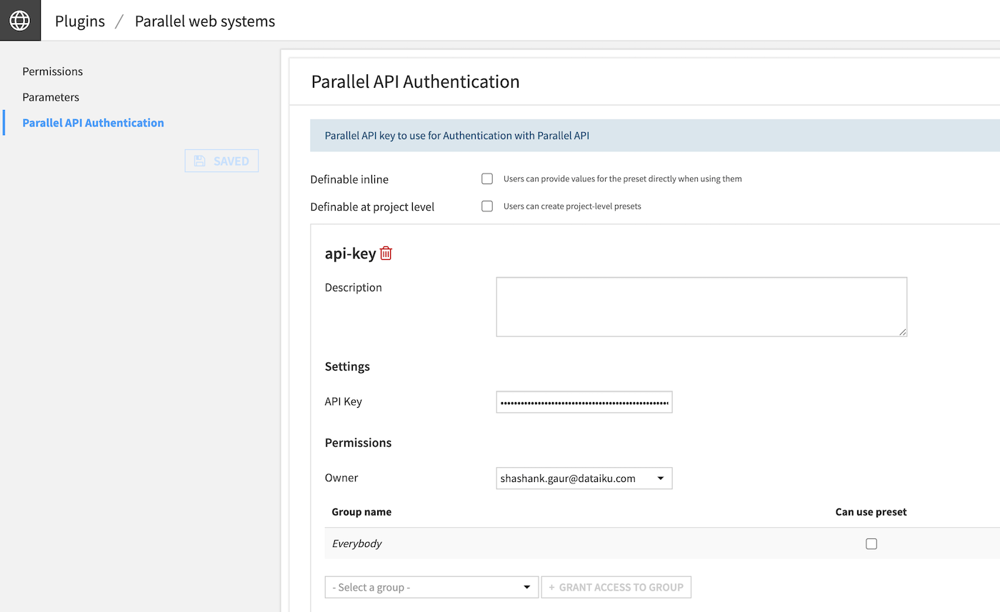
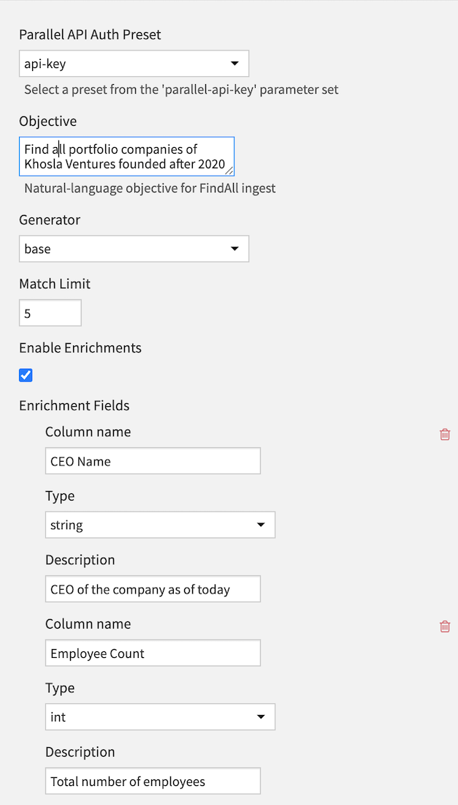
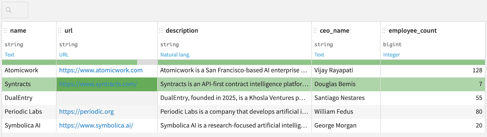
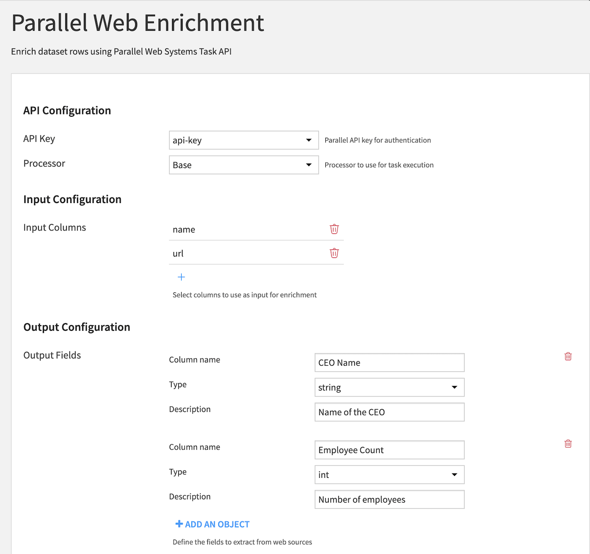

# dss-parallel-web-plugin

Dataiku plugin providing web data generation and enrichment capabilities powered by Parallel Web Systems APIs using the official Python SDK (`parallel-web`).

## Features

This plugin provides three main components:

1. **Dataset Connector**: Generate datasets from web searches using the Parallel FindAll API
2. **Enrichment Recipe**: Enrich existing datasets with web-sourced information using the Parallel Task API
3. **Agent Tool**: Enable AI agents to search the web intelligently using the Parallel Search API

---

## Getting Started

### 1. Configure API Authentication

First, set up your Parallel API key in the plugin settings:

1. Navigate to **Plugins** → **Parallel web systems** → **Parallel API Authentication**
2. Create a new preset (e.g., "api-key")
3. Enter your Parallel API key
4. Configure permissions as needed



---

## Dataset Connector

The connector generates datasets by finding and extracting information from the web based on a natural language objective.

### How It Works

The connector executes this SDK flow:
1. `client.beta.findall.ingest(objective=...)` to create a FindAll schema.
2. `client.beta.findall.create(run_input)` to start the run.
3. Poll `client.beta.findall.retrieve(findall_id=...)` until completion.
4. Read candidates via `client.beta.findall.result(findall_id=...)`.

### Configuration

#### Required Settings

- **Parallel API Auth Preset**: Select the preset you configured (e.g., "api-key")
- **Objective**: Natural language description of what you want to find

#### Optional Settings

- **Generator**: Select the processing engine (`preview`, `base`, `core`, `pro`)
- **Match Limit**: Maximum number of results to return
- **Enable Enrichments**: Add additional structured fields to extract
- **Enrichment Fields**: Define custom fields with name, type, and description
- **Include Unmatched**: Include candidates whose `match_status` is not `matched`
- **Include Citations**: Include `basis` (citations/reasoning) in rows
- Polling controls for monitoring job progress

### Example: Researching Khosla Ventures Portfolio Companies

**Objective**: `Find all portfolio companies of Khosla Ventures founded after 2020`

**Configuration**:
- **Generator**: `base`
- **Match Limit**: `5`
- **Enable Enrichments**: ✓
- **Enrichment Fields**:
  - Column: `CEO Name`, Type: `string`, Description: "CEO of the company as of today"
  - Column: `Employee Count`, Type: `int`, Description: "Total number of employees"



**Output Dataset**:

The connector will generate a dataset with columns including company name, URL, description, CEO name, and employee count:



---

## Parallel Web Enrichment Recipe

This custom recipe enriches dataset rows using the Parallel Web Systems Task API. It takes an input dataset, extracts structured information from the web for each row, and writes the enriched data to an output dataset.

### Features

- **Flexible Input**: Select any number of columns from your input dataset to use as context for web enrichment
- **Dynamic Output**: Define custom output fields with descriptions to extract specific information
- **Error Handling**: Continue processing even if individual rows fail, with optional error tracking
- **Batch Processing**: Configure batch sizes for optimal performance
- **Configurable Timeouts**: Set maximum wait times and polling intervals

### Configuration

#### API Configuration

- **API Key**: Select a Parallel API key preset for authentication
- **Processor**: Choose the processing engine (core, base, or fast)

#### Input Configuration

- **Input Columns**: Select one or more columns from your input dataset to use as input for the enrichment task. These columns will be provided to the API as context for extracting information.

#### Output Configuration

- **Output Fields**: Define the fields you want to extract from web sources. Each field requires:
  - **Column name**: The name of the output column (e.g., "founding_year")
  - **Type**: The data type for this field (string, int, float, or bool)
  - **Description**: A description of what information to extract (e.g., "The year the company was founded")

#### Advanced Settings

- **Max Wait Time**: Maximum time in seconds to wait for each task to complete (default: 300)
- **Poll Interval**: Time in seconds between status checks (default: 2)
- **Batch Size**: Number of rows to process before writing to output (0 = all at once, default: 100)
- **Continue on Error**: If enabled, processing continues even if individual rows fail. Failed rows will have empty enrichment values and an error message in the `_enrichment_error` column.

### Example: Enriching Dataset with CEO and Employee Information

You can use the enrichment recipe to add information to an existing dataset generated by the connector or any other dataset.

**Configuration**:



- **API Key**: Select your configured preset (e.g., "api-key")
- **Processor**: `Base`
- **Input Columns**: `name`, `url` (from your existing dataset)
- **Output Fields**:
  - Column: `CEO Name`, Type: `string`, Description: "Name of the CEO"
  - Column: `Employee Count`, Type: `int`, Description: "Number of employees"

### Usage Tips

1. **Start Small**: Test with a small subset of your data first to verify the configuration
2. **Descriptive Field Definitions**: Provide clear, detailed descriptions for output fields to get better results
3. **Error Tracking**: Enable "Continue on Error" to avoid losing progress on large datasets
4. **Batch Processing**: Use smaller batch sizes for very large datasets to see progress more frequently

### Performance Considerations

- Processing time depends on the complexity of the enrichment task and the processor selected
- Consider the API rate limits when processing large datasets
- Learn more about choosing the right processor: [Parallel AI Processor Guide](https://docs.parallel.ai/task-api/guides/choose-a-processor)

### Troubleshooting

**Issue**: Recipe fails with "API key not configured"
- **Solution**: Ensure you have created a Parallel API key preset in the plugin settings

**Issue**: Tasks are timing out
- **Solution**: Increase the "Max Wait Time" setting or simplify your output field definitions

**Issue**: Empty output values
- **Solution**: Check the `_enrichment_error` column (if "Continue on Error" is enabled) for error messages. Verify that your input columns contain valid data.

---

## Parallel Web Search Agent Tool

This agent tool enables Dataiku AI agents to search the web intelligently using Parallel's Search API. The tool provides relevant web pages with titles, URLs, and text excerpts that agents can use to answer questions and gather information.

### How It Works

The tool uses Parallel's Search API to:
1. Accept a natural language objective from the AI agent
2. Execute intelligent web searches based on the objective
3. Return relevant results with excerpts from web pages
4. Provide source attribution for traceability

### Configuration

Configure the tool in **Plugins** → **Parallel web systems** → **Parallel Web Search**:

#### Required Settings

- **Parallel API Auth Preset**: Select your configured API key preset (e.g., "api-key")

#### Optional Settings

- **Search Mode**: Choose how the search is optimized (default: `agentic`)
  - **one-shot**: Comprehensive results with longer excerpts - best for direct user queries
  - **agentic**: Concise, token-efficient results for multi-step workflows (recommended for agents)
  - **fast**: Optimized for latency-sensitive use cases (~1s response time)

- **Max Results**: Maximum number of search results to return (1-20, default: 5)

- **Max Characters Per Excerpt**: Maximum characters per excerpt from each result (100-10000, default: 1000)

### Usage in AI Agents

Once configured, the tool becomes available to your Dataiku AI agents. The agent simply needs to provide:

- **objective**: A clear description of what information to find

**Example agent queries:**
- "When was the United Nations established? Prefer UN's websites."
- "What are the latest developments in quantum computing?"
- "Find information about renewable energy policies in California"

### Example Output

When an agent uses the tool, it receives structured results like:

```
Found 3 result(s) for objective: 'When was the United Nations established? Prefer UN's websites.'

**United Nations - History**
URL: https://www.un.org/en/about-us/history-of-the-un

Excerpts:
1. The United Nations officially came into existence on 24 October 1945, when the Charter had been ratified by China, France, the Soviet Union, the United Kingdom, the United States and by a majority of other signatories...

---

**UN Charter - Signing and Ratification**
URL: https://www.un.org/en/about-us/un-charter

Excerpts:
1. The Charter was signed on 26 June 1945 by the representatives of the 50 countries...
```

### Benefits for AI Agents

- **Up-to-date Information**: Access current web content beyond the agent's training data
- **Source Attribution**: All results include URLs for verification and citation
- **Intelligent Search**: Parallel's API understands context and returns relevant results
- **Token Efficient**: Agentic mode provides concise results optimized for multi-step reasoning
- **Flexible**: Works seamlessly in agent workflows for research, fact-checking, and information gathering

### Performance Considerations

- The **agentic** mode is recommended for agent workflows as it provides token-efficient results
- Use **fast** mode when latency is critical and speed is more important than comprehensive excerpts
- Use **one-shot** mode for direct user queries where comprehensive results are needed
- Learn more about search modes: [Parallel Search API Documentation](https://docs.parallel.ai/search-api)
